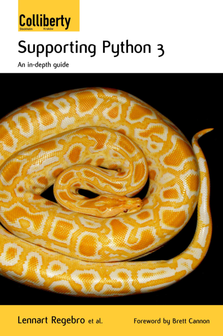
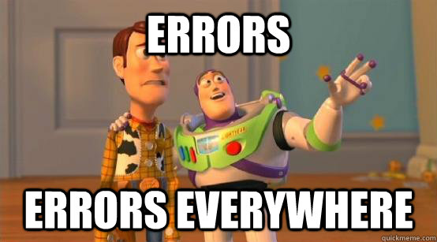

:skip-help: true
:css: css/stylesheet.css
:title: Moving Big Projects to Python 3

.. footer::

    .. image:: images/britecore.png

----

Moving Big Projects to Python 3
===============================

.. class:: name

    Lennart Regebro, Architect

.. class:: location

    PyCon US, 2020

----

.. image:: images/magda_elenor.jpg
    :class: left
    :width: 70%

.. image:: images/elenor_quince.jpg
    :class: right
    :width: 29.5%

.. note::

    My name is Lennart, and  I'm born in Sweden,
    but I live in Poland, with my wife, daughter, three cats and way too many fruit trees.

    I have been using Python since Python 1.5.2, and
    I have been working with Python and web since 2001.

----

:id: britecore

.. class:: blurb

BriteCore is the leading technology platform for modern insurance providers.
Fully managed through Amazon Web Services cloud, BriteCore is continually
updated to guarantee maximum security, efficiency, and durability at scale.
Over 45 Carriers, MGAs, and InsureTechs rely on BriteCore for their core, data,
and digital needs.

.. note::

    I work for BriteCore.

    We do the type of software that insurance companies use to deal with
    insurance policies and claims.

    We are not fully on Python 3 yet, the core system is still Python 2.7.

----

.. image:: images/shoobx.png
    :width: 600px

.. note::

    But I should also shout out to my previous job Shoobx,
    where we successfully moved a large and insanely
    complex system to Python 3 in 2018.

----

python3porting.com

.. note::

    And I wrote the book on how to move from Python 2 to Python 3.
    You can find it in both HTML and PDF on python3porting.com.
    It's open source, the source is on github.

    But this talk isn't about that book.
    Because that book is concerned with differences in code.
    And not only has those differences grown smaller since that book first came out.
    Changing the code is actually the easy part.

----

.. image:: images/stoneage.jpg
    :width: 800px

.. note::

    But let's start at the beginning, back in the stoneage.

----

.. image:: images/grok.png
    :height: 600px

.. note::
    This is you back in the stone age, and this is your framework.

    You or your company created some Python application,
    and did such a good job that it's still running!

    It's probably a webapp and you are probably running
    it on some old version of maybe Web2py maybe Turbogears,
    maybe even Zope!

----

.. image:: images/sirrobin.jpg
    :width: 100%

.. note::

    And you have been bravely running away from Python 3 for years.
    But you can't run any longer, because this year Python 2's
    brave suicide plan sprung into action.

    But don't fear Python 3,
    it's not The Killer Rabbit of Caerbannog,

----

.. note::

    it's just a regular old Python.

    It's time to hug the snake.
    But how to go about it, that is the question.

----

The Stages of Porting
=====================

1. Stop firefighting

2. Preparing

3. Porting

4. Push to production

5. Cleanup

.. note::

    I'd say there are five stages of porting,and and the start hard and get easier.
    And as you see, the first and hardest stage has absolutely nothing to do with Python 3.
    The preparing stage can be equally tricky,
    especially if you haven't kept your dependencies up to date.
    Porting can be easy, and can be tricky,
    and that depends both on how magic your code is and how large your team is.
    Pushing Python 3 to production tends to require several attempts,
    but isn't otherwise very hard, and the cleanup is very easy.

----

Strategies for porting
======================

.. note::

    But before we dive into that we need to discuss the general strategy for porting,
    because this affects both the preparing and the porting stage.

    There are basically two strategies you can use when moving
    a project to Python 3, and they aren't even mutually exclusive,
    you can do both.

    Which is best depends on if you can stop adding features for a while,
    how big your team is, and how magical your code is.

----

1. Can you stop adding features?
================================

.. note::

    It depends very much on your business
    if you can take a time out from adding features to do the porting or not.
    But it still will take a few weeks at least. Maybe longer.
    So can you stop adding features and stop firefighting that long?

----

2. How big is your team?
========================

.. note::

    The famous mythical man-month remains mythical also with Python 3.
    Putting 50 developers on porting at the same time will not work.
    They will end up being blocked by each other,
    and you can't distribute the work properly.
    Ten isn't a problem, you can synchronize that, at least if they are
    in the same office. Maybe even 20, but no more than that.
    If your system is already split into multiple separate services
    that run separately, then you can probably put each team on porting their bit separately,
    so then you are already ahead of the game, but most of these big systems are monoliths.

----

3. Do you have magic?
=====================

.. note::

    And if some parts of your code is doing deep magic, it can be very hard to port.
    And then the few of your Python gods that actually understand that code,
    will be busy with that, when everything else already works.
    Or, it's so deeply integrated in the code that nobody can actually port their bits
    until that deep magic is fixed.
    In both of those cases, everyone that are supposed to port to Python 3 will be blocked.

----

Strategy: One big push!
=======================

.. note::

    You don't have deep magic.
    You can stop adding features.
    You have less than 20 developers.

    Then you can do it all in one go.

----

One big push: Benefits
======================

Takes less time

Less work in total

You can aim directly for Python 3 code

----

One big push: Drawbacks
=======================

High risk

All other work stops

.. note::

    So I don't recommend doing this.
    If you feel you can move your project to Python 3 in one go,
    then you would likely have done so already.

----

Strategy: Slow and steady
=========================

.. note::

    So porting big projects to Python 3 is usually done slowly and carefully.
    You will port the code to code that runs on both Python 3 and Python 2,
    even though you run it on Python 2.
    And then, one day, you can finally switch and run it on Python 3.

----

Slow and steady: Benefits
=========================

Low risk

Doesn't disrupt normal operations

----

Slow and steady: Drawbacks
==========================

More work

Longer total time

You need dual version support

----

Strategy: Mix it up!
====================

.. note::

    If you have a development team small enough to fit into one big country house,
    you can start with a Python 3 sprint for all the developers,
    but not aim for Python 3, but aim for a Python 2/3 compatible code.
    That way, when they come back half done,
    you can switch to have a dedicated team do the last bit,
    or just have people do it when there is no critical work.

    This is what we did at Shoobx.

----

Mix: Benefits
=============

Low risk

Only disrupts normal operation briefly

Everyone gets onboard and feels involved

----

Mix: Drawbacks
==============

You need dual version support

Still slow

.. note::

    But all in all I think this is a good option if you have less than 20 developers.

----

Stage 1: Stop being a fire department!
======================================

.. image:: images/firefighting.jpg
    :width: 80%

.. note::
    The first thing you need to do is stop being a fire department.

    Many large organizations are constantly putting out fires.
    That's not a good situation to port to Python 3,
    because if the changes you do as a part of normal development breaks production,
    and you need to put out that fire,
    then moving to Python 3 is going to start new fires.
    Also, all your developers will be too busy putting out fires to port things.

    So the first thing you need to do is to get out of firefighting mode.
    And that in itself is a whole talk,
    and I'm not the one to do that talk anyway.
    I'll quickly mention a few things I've seen DevOps do to fix this.

----

:id: firefighting

Increase test coverage

Continuos integration

Use staging servers

Containers/Docker or similar

Automatic deployment

Monitoring

.. note::

    This slide  assumes that your software is a service
    of some sort, with a production environment and devops,
    because that's all the fire fighting I know.

    You HAVE to have tests to move to Python 3,
    but tests also help with stability.
    And you have to run those tests,
    and that means that for any sizeable project you must have CI.
    I'll talk more about that later.

    Switching to Python 3 without a staging setup would also be insane.

    Automatic deployment is helpful.
    Deployment of a new release of the software should just be a push of the button.
    Extra points if master is released and pushed to staging every night,
    so you know that your deployment is working.

    Monitoring is good, you want to know that there is a problem
    before your users know it.

----

Stage 3: Preparing
==================

.. note::

    When the firefighting is done, it's time to prepare.

----

Pin all versions
================

.. note::

    To make sure that you know what you install,
    you should pin all versions of all packages.

----

:id: pins

.. code::

    beautifulsoup4==4.6.0
    amqp==1.4.7
    boto==2.38.0
    boto3==1.6.23
    botocore==1.9.23
    datadog==0.12.0
    placebo==0.8.1
    awscli==1.10.10
    colorama==0.2.4
    coverage==3.5.2
    dropbox==7.2.1
    epydoc==3.0.1
    ezodf2==0.2.9

.. note::

    pip unfortunately has no flag I can find to require this.
    One way to do this would be to verify in the install script
    that what you installed matches the requirements file,
    by f ex comparing your pip freeze output with the requirements file.
    That way, you would get an error if you change one package
    that introduces new dependencies.

----

:id: hashes

.. code::

    beautifulsoup4==4.6.0 --hash=sha256:7015e76bf32f1f574636c4288399a6de66
    amqp==1.4.7 --hash=sha256:d5ab52b96c11a93324e4f8e5f35fac8a58e69eba0555
    boto==2.38.0 --hash=sha256:758498c77f16e26b8b61af26f8d0dbb119b713f2d8d
    boto3==1.6.23 --hash=sha256:f270f058f46aff9208fe29cffee79a46a7020cd186
    botocore==1.9.23 --hash=sha256:fa84972784e55ae5f89c2d33b1b10b6ba028cb3
    datadog==0.12.0 --hash=sha256:453facddea3bdce14bfe6518d65db8ec8f1b3309
    placebo==0.8.1 --hash=sha256:6c15ce4a6be158603550fa211f7ce7cc0327c5e45
    awscli==1.10.10 --hash=sha256:f8d53c0e3211353a6d4eefb82432996eff535ad4
    colorama==0.2.4 --hash=sha256:f1a742e49fbb0838ab478339597580d8a5869f9f
    coverage==3.5.2 --hash=sha256:22f8828c83958efc343666926362eb4a6cb38610
    dropbox==7.2.1 --hash=sha256:34fe06b735358f4454d59e2ea3dadff63fa03e076
    epydoc==3.0.1 --hash=sha256:87f191ef04783f8871ce085f8527c8519a74e401c7
    ezodf2==0.2.9 --hash=sha256:bda2added62f3c3c02c9385fcaaf7a2beed3f3b42a

.. note::

    What you can do with pip is to add hashes to the requirements,
    if you add one hash, it will require hashes for all packages,
    effectively making sure no new requirement goes unpinned.

    This makes for huge requirements files with loads of hashes in them.
    But it also adds extra security.

----

Increase test coverage
======================

.. note::

    It is very good to cover a line, because lines that aren't covered may
    contain hidden Python 2 code.

    What percentage of test coverage you want is really a matter of opinion.
    100% is awesome, but is likely practically unobtainable.
    90-95% would be my target. You can bridge the gap somewhat by
    carefully reading all non-covered lines and looking for Python 2 syntax
    on the non-covered lines,
    at some point that becomes easier than writing a test.

----

Mock gotchas
============

.. note::

    There exists this philosophy in unit tests that you should test each function
    separately and that all calls to outside the module should be mocked out.
    Some people even refuse to call it a unit test if this isn't done.

    But if you do this, then you only test that the function did what you told it to do.
    You don't test that it WORKS. For example, if the API you call changes,
    then the test will still pass.
    This is obviously a problem with Python 3, because you will effectively
    be mocking in Python 2 behavior.
    So this type of testing is useless when porting to Python 3.
    It does little more than checking the syntax,
    and all you need for a syntax check is to import the module.
    If you do this kinds of unit test mocking,
    you need to have 95% coverage from your integration tests.

----

Upgrade dependencies
====================

Upgrade all packages

Replace or port anything that isn't Python 3 compatible

.. note::

    Make sure you have the latest Python 2 compatible version of all your dependencies.
    Then make sure all your dependencies are Python 3 compatible.
    You may have to replace, or worst case, port, some of your dependencies at this point.

    This stage can take a significant time, especially if you have not been keeping
    your dependencies up to date.

----

Port or decouple the build scripts
==================================

.. note::

    Usually you have some sort of tool to build a test or development environment.
    More often or not, that tool is in Python.
    It typically import the app you are to port.
    That means that to port the app, you first need to port the build tool,
    but to port the build tool you need to port the app.

----

Porting the build scripts
=========================

.. note::

    It's a nice catch 22,
    and that means someone must first fix all the syntax errors under Python 3,
    so that the build scripts at least can import the app.
    And that's not something you can put a whole team on.
    Therefore it's a part of the preparation stage,
    and in practice that means you have to support both Python 2 and Python 3 with your app.

----

Decouped build scripts still need Python 3
==========================================

.. note::

    As an alternative you can decouple the build scripts
    so that they don't need to import the app.
    Or maybe the build scripts already are so decoupled that they don't import the app,
    or are written in something that isn't Python.
    You might also have configuration files, maybe Docker or Saltstack.
    Then all these scripts need to support Python 3,
    so that they can build your development and test environments with Python 3 or Python 2.

----

Setup your testing for Python 3
===============================

.. note::

    It's now time to start running your tests under Python 3,
    and this will obviously always fail.
    But that's OK. What you want to do here is to prevent people
    from adding more Python 3 incompatible code while others are trying
    to add Python 3 compatibility.

----

.. image:: images/backwards.gif
    :width: 100%

.. note::

    Because if you allow that sort of backsliding you will never finish.
    And the trick to stopping this is in CI.

----

Gradual CI coverage
===================

.. note::

    You need to let your CI system keep track
    of which tests that once DID pass under Python 3,
    and flag the test run as failed if one of those tests failed.
    But tests that always failed under Python 3?
    They should be allowed to fail.

    And be careful to keep this on.
    At Shoobx we had to disable it temporarily for reasons I forgot,
    and of course we forgot to enable it until several months later.
    Hundreds of tests had started failing on Python 3 in the mean time.
    IIRC it only took a few days to get back on track.

----

Stage 4: Porting
================

----

Tools
=====

2to3

Six

Modernize

.. note::

    I'm sure you know what 2to3 is,
    it's a tool that will refactor your code from Python 2 to Python 3 code.
    It doesn't do everything, but it's helpful.
    Modernize is an extension that generate Python 2 compatible code,
    mostly by using six, which is the compatibility library between Python2 and Python 3.

    There's also another compatibility layer called python-future which
    has it's own extension called futurize.
    Python-future inserts a lot of magic to make the code
    compatible with both Python 2 and Python 3,
    and that magic has bitten me several times,
    so my recommendation is to avoid python-future.

----

.. note::

    Your first errors will be syntax and import errors.
    That's because some module with have a syntax error,
    and the modules trying to import from that module then get an import error.
    So the first thing you want to do is fix those syntax errors.

----

One fixer at a time
===================

.. note::

    If you run modernize on any larger code base,
    the system won't still work after that,
    and with the massive changes you get,
    it can be hard to figure out what went wrong.
    It's better to do it carefully.

    Therefore, you should run one fixer at a time.
    Find the cause of the error you have,
    and if there is a fixer for that, run that fixer.
    Maybe even on just that one file.
    Big changes get confusing when they fail.

    But manually fixing each single import or syntax error is boring.
    So use the modernize fixers to help alleviate the boredom.

----

Fix fix fix
===========

.. note::

    This is where the book finally is useful.
    Because it's about this part, and this part only.

    The only difficult bits here is if you have deep magic,
    as mentioned before.

    As you get more confident, and more things work,
    you can run fixers on more files in one go,
    but if you are many people doing the porting you risk merge conflicts.

----

Don't forget the your dev environment
=====================================

.. note::

    Do you have scripts to set up a development environment?
    Or are you using docker? Something else?
    In any case, that environment should be able to be built under Python 2 or Python 3 or both.
    Any build scripts you have need to support both versions,
    any auxilary scripts you have also need to do that.

    At BriteCore we for example have scripts that help you copy test databases,
    set up docker images etc. It's usually easier if they support Python 2 and Python 3
    first, so you don't have to keep two environments going.
    Sometimes the dev help scripts already run in a separate virtualenv,
    and then you might be able to port them later.
    But then again, if they are separate, you might want to do them first as practice!

----

Write data migration tests
==========================

Do you get text strings when you expect text strings?

Are non-ascii chéracters interpreted corröctly?

Are you loading data from disk at some point?

Expert level: Using Pickles!

.. note::

    You should take data that is created with the software running on Python 2,
    and write tests to make sure you get the right data in Python 3.

----

Push to staging
===============

Test it carefully, manually, with real data

.. note::

    If all tests pass, or maybe even before all tests pass, try it on staging.

----

Stage 5: Push to production
===========================

Be prepared to fall back if possible!

.. note::

    If you have the possibility to move customers one by one, do that.
    Start small, work yourself up.

    If you have to migrate the database, you may not be able to go back to Python 2,
    so in that case you need to be extra careful.

----

Celebrate!
==========

.. image:: images/party.gif
    :width: 100%

----

Clean up
========

.. image:: images/cleanup.jpg
    :width: 100%

.. note::

    And then clean up.
    Actually, that picture is a misrepresentation.

----

Stage 6: Clean the code
=======================

.. image:: images/funclean.jpg
    :width: 100%

.. note::

    Because this is the fun bit.
    This is where you can go through the code and remove loads of old cruft.
    See it as an opportunity to just prettify the code.

----

.. image:: images/done.gif
    :width: 100%

----

Summary
=======

Stop firefighting

Prepare

Fixing tests under Python 3

Push to staging

Push to production

Clean up the code

----

Questions?
==========

britecore.com/careers
